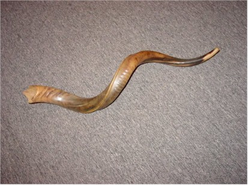

# Starbirth Kudu Shofar

> Starbirth is the internet band project name for Martin Schiff.
Martin composes music in various styles, including New Age, Ambient,
World Fusion, Jazz, Progressive Rock, Industrial, Trance, Goa and more.
You can listen to some of the newer songs at our [Soundclick Music Site].

Traditional shofar calls played and recorded by Martin Schiff. 

Converted from the original GigaSampler version by S. Christian Collins
www.schristiancollins.com

## Details

There are 3 different calls:

Tekiah - a long blast (varying lengths)\
Shevarim - a wailing sound\
Teruah - a broken trumpet sound

C4 - G4 - Tekiah (all notes, including half steps)\
A5, B5 - Teruah\
C5, D5 - Shevarim\
E5 - low note\
E6, E7 high note

## License

You may use them in any way you wish to make music either for your own use,
or commercially, but you MAY NOT sell the samples,
or include them in a compilation for samples for sale.

[Soundclick Music Site]: https://www.soundclick.com/artist/default.cfm?bandid=4828
